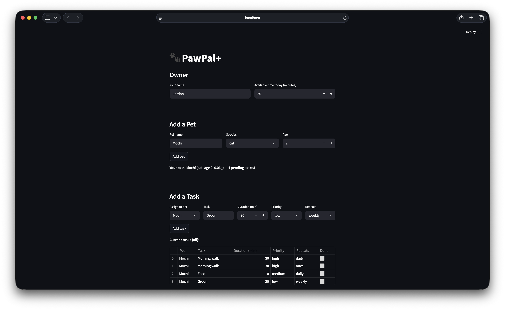
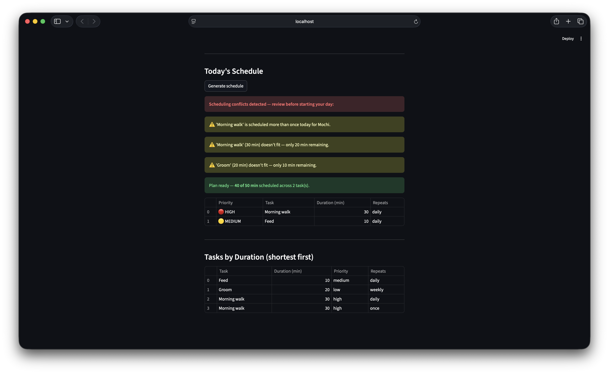

# PawPal+ (Module 2 Project)

You are building **PawPal+**, a Streamlit app that helps a pet owner plan care tasks for their pet.

## Scenario

A busy pet owner needs help staying consistent with pet care. They want an assistant that can:

- Track pet care tasks (walks, feeding, meds, enrichment, grooming, etc.)
- Consider constraints (time available, priority, owner preferences)
- Produce a daily plan and explain why it chose that plan

Your job is to design the system first (UML), then implement the logic in Python, then connect it to the Streamlit UI.

## What you will build

Your final app should:

- Let a user enter basic owner + pet info
- Let a user add/edit tasks (duration + priority at minimum)
- Generate a daily schedule/plan based on constraints and priorities
- Display the plan clearly (and ideally explain the reasoning)
- Include tests for the most important scheduling behaviors

## Getting started

### Setup

```bash
python -m venv .venv
source .venv/bin/activate  # Windows: .venv\Scripts\activate
pip install -r requirements.txt
```

## Smarter Scheduling

PawPal+ goes beyond a basic task list with three additional scheduling features:

- **Sort by time** — `DailyPlanner.sort_by_time()` returns today's pending tasks ordered by duration (shortest first), useful for quick wins early in the day.
- **Filter tasks** — `DailyPlanner.filter_tasks(completed, pet_name)` lets you query tasks by completion status, by pet, or both combined.
- **Recurring tasks** — `CareTask` supports `frequency="daily"` or `frequency="weekly"`. Calling `Pet.complete_task()` marks the task done and automatically schedules the next occurrence using `timedelta`.
- **Conflict detection** — `DailyPlanner.detect_conflicts()` scans for duplicate task types on the same day and tasks that exceed the owner's time budget, returning human-readable warnings instead of crashing.

## Testing PawPal+

### Running the tests

```bash
python3 -m pytest tests/test_pawpal.py -v
```

### What the tests cover

| Area | Tests | What is verified |
|---|---|---|
| **Sorting** | `test_sort_by_time_*` | Tasks are returned in ascending duration order; completed and future-dated tasks are excluded |
| **Recurrence** | `test_daily_task_*`, `test_weekly_task_*`, `test_once_task_*` | Completing a `daily` task spawns a new task for tomorrow; `weekly` tasks schedule 7 days out; `once` tasks do not recur |
| **Conflict detection** | `test_conflict_detected_*`, `test_no_conflicts_*` | Duplicate task types on the same day trigger a warning; tasks that overflow the time budget trigger a budget warning; a clean schedule produces no warnings |
| **Edge cases** | `test_pet_with_no_tasks_*`, `test_owner_with_no_pets_*` | A pet with zero tasks returns an empty list and a correct summary; an owner with no pets generates an empty plan without errors |

### Confidence Level

**★★★★☆ (4 / 5)**

All 12 tests pass against the current implementation. The core scheduling behaviors — priority sorting, time-budget enforcement, recurring task generation, and conflict detection — are verified. One star is withheld because the Streamlit UI layer (`app.py`) is not covered by automated tests, and real-world inputs (e.g., negative durations, empty strings) are not yet validated at system boundaries.

---

## 📸 Demo

<a href="images/pawpal1.png" target="_blank"></a>

<a href="images/pawpal2.png" target="_blank"></a>

## Features

### Priority-based daily planning
`DailyPlanner.generate_plan()` filters all tasks due today and sorts them **HIGH → MEDIUM → LOW** using a weighted key. It then performs a greedy fit against the owner's available time budget, including only tasks that fit without overflow. The result is a ranked list of tasks the owner can realistically complete today.

### Conflict warnings
`DailyPlanner.detect_conflicts()` runs two independent checks:
- **Duplicate detection** — scans each pet's task list for two or more tasks of the same type scheduled on the same day, and emits a named warning per duplicate.
- **Budget overflow detection** — simulates the same greedy scheduling pass as `generate_plan()` and flags any task that would exceed the remaining available time.

Warnings appear in the UI **above** the schedule using `st.error` / `st.warning` so owners can resolve conflicts before starting their day.

### Recurring tasks (daily and weekly)
`CareTask` carries a `frequency` field (`"once"`, `"daily"`, `"weekly"`). When `Pet.complete_task()` is called, it delegates to `CareTask.mark_complete()`, which marks the task done and returns a new `CareTask` instance scheduled for the next occurrence using `datetime.timedelta`. The new task is appended to the pet's task list automatically — the owner never has to re-enter a repeating task.

### Sort by duration (quick-wins view)
`DailyPlanner.sort_by_time()` returns today's pending tasks sorted by `duration_minutes` ascending. This secondary view (shown below the main plan in the UI) helps owners knock out short tasks first when time is tight.

### Flexible task filtering
`DailyPlanner.filter_tasks(completed, pet_name)` supports three query modes:
- By completion status alone (`completed=True` or `completed=False`)
- By pet name alone (case-insensitive match)
- Both combined — e.g., "what has Buddy not done yet today?"

### Multi-pet support
An `Owner` can register any number of `Pet` objects. `get_all_tasks()` aggregates tasks across every pet into a flat list, so all planner methods work uniformly regardless of how many pets are registered.

---

### Suggested workflow

1. Read the scenario carefully and identify requirements and edge cases.
2. Draft a UML diagram (classes, attributes, methods, relationships).
3. Convert UML into Python class stubs (no logic yet).
4. Implement scheduling logic in small increments.
5. Add tests to verify key behaviors.
6. Connect your logic to the Streamlit UI in `app.py`.
7. Refine UML so it matches what you actually built.
